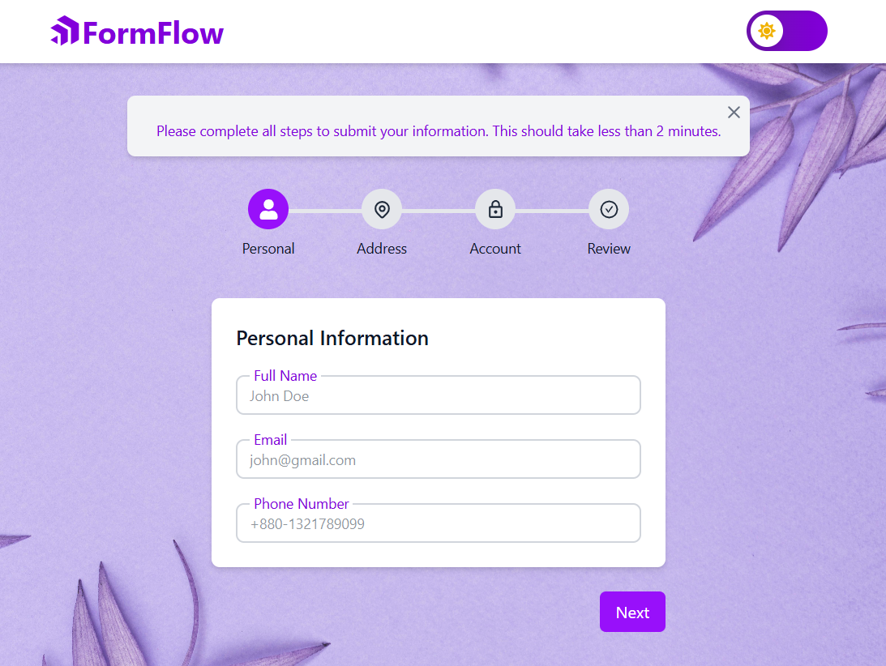

# Multi-Step Form with Validation


A front-end project built using **Next.js** and **React** that showcases a responsive, multi-step form with step-wise validation using **Zod** and **React Hook Form**. The form collects personal, address, and account details, and includes features like field-level validation, navigation between steps, and a final data review screen before submission.

🚀 Live Demo: [FormFlow](https://multi-step-form-snowy-six.vercel.app/)

---

## 📑 Table of Contents

- [Features](#✨-features)
- [Tech Stack](#🛠️-tech-stack)
- [Installation](#📦-installation)
- [Usage](#🚀-usage)
- [Configuration](#⚙️-configuration)
- [Troubleshooting](#🐛-troubleshooting)
- [Form Steps](#📝-form-steps)
- [Live Demo & Repository](#live-demo)
---

## ✨ Features

- Step-by-step form with intuitive navigation (Next / Previous)
- Field validation using **Zod** and **React Hook Form**
- Final review screen with all submitted data
- TailwindCSS for fully responsive styling
- Dark mode support via `next-themes` and `TailwindCss`
- Password confirmation and validation logic
- Inline error messages per field
- Data managed via local state (`useState` / `useReducer`)

---

## 🛠️ Tech Stack

- **Next.js** (v15+ with App Router)
- **React** (v19)
- **React Hook Form**
- **Zod** (form validation)
- **TailwindCSS**
- **React Icons**
- **Next Themes** (for dark mode)
- **TypeScript**
---

## 📦 Installation

### Steps
1. **Clone the repository**

```sh
# Clone the repository
git clone https://github.com/Soraiya11-7/multi-step-form

# Navigate to the project directory
cd multi-step-form
```
2. **Install dependencies**

```sh
npm install
# or
yarn install
```
---
## 🚀 Usage

### ▶️ Start the development server

```bash
npm run dev
```
### 🏗️ Build for production

```bash
npm run build
npm run start
```

### 🔍 Lint your code

```bash
npm run lint
```
---
## ⚙️ Configuration

- All configuration is handled by **Next.js** and **TailwindCSS** by default.

- **Dark mode** is implemented using a custom setup based on Tailwind CSS v4 and Next.js 15.

✅ Ensure your app is wrapped in a proper `ThemeProvider` and your CSS includes the correct dark mode configuration.

🔗 For detailed guidance, refer to this resource:  
[Dark Mode in Next.js 15 + Tailwind CSS v4](https://sujalvanjare.vercel.app/blog/dark-mode-nextjs15-tailwind-v4)

---

## 📚 Dependencies

### 👉 Main Dependencies

| Package                | Version     | Description                                 |
|------------------------|-------------|---------------------------------------------|
| `next`                 | 15.2.5      | React framework for server-rendered apps    |
| `react`                | ^19.0.0     | UI library for building interfaces          |
| `react-hook-form`      | ^7.55.0     | Hook-based form handling                    |
| `@hookform/resolvers` | ^5.0.1      | Integration of validation libraries with RHF|
| `zod`                  | ^3.24.2     | Schema-based form validation                |
| `react-icons`          | ^5.5.0      | Popular icons for React apps                |
| `next-themes`          | ^0.4.6      | Theme toggling (e.g., dark mode) for Next.js|
| `postcss`              | ^8.5.3      | CSS post-processor used by Tailwind         |

---

### 🛠️ Dev Dependencies

| Package                  | Version     | Description                                   |
|--------------------------|-------------|-----------------------------------------------|
| `typescript`             | ^5          | Static type checking for JavaScript           |
| `eslint`                 | ^9          | Linter for maintaining code quality           |
| `eslint-config-next`     | 15.2.5      | ESLint rules optimized for Next.js            |
| `@types/node`            | ^20         | Type definitions for Node.js                  |
| `@types/react`           | ^19         | Type definitions for React                    |
| `tailwindcss`            | ^4.1.3      | Utility-first CSS framework                   |
| `@tailwindcss/postcss`   | ^4.1.3      | PostCSS plugin adapter for Tailwind CSS       |

---
## 🐛 Troubleshooting

- **Tailwind not working?**  
  - Ensure TailwindCSS is properly imported in your `globals.css` file and that `postcss.config.mjs` is correctly configured.

- **Validation issues?**  
  - Double-check that your Zod schemas align with the fields and rules in each form step.

- **Routing problems?**  
  - Confirm that you're using the **App Router** (i.e., the `/app` directory structure) introduced in **Next.js 13+**. Routing should be file-based and follow the conventions for pages, layouts, and nested routes.

  ---
## 📝 Form Steps


### 🔹 Step 1: Personal Information

- **Full Name** – _required_
- **Email** – _required_, must be in a valid format (e.g. `example@email.com`)
- **Phone Number** – _required_, minimum **10 digits**

---

### 🔹 Step 2: Address Details

- **Street Address** – _required_
- **City** – _required_
- **Zip Code** – _required_, numbers only, minimum **5 digits**

---

### 🔹 Step 3: Account Setup

- **Username** – _required_, minimum **4 characters_
- **Password** – _required_, minimum **6 characters_
- **Confirm Password** – _must match password_

---


## 🌍 Live Demo & Repository

### 🚀 Live URL
   - Vercel: [FormFlow](https://multi-step-form-snowy-six.vercel.app/)
   - Screen Recording Link: [FormFlow Walkthrough](https://drive.google.com/file/d/1Sz83rjkV5FG9rtAdAWx33ZLA6tR-6eTp/view?usp=sharing)

🔗 GitHub Repository: [GitHub Link](https://github.com/Soraiya11-7/multi-step-form)

---

🚀 Seamlessly collect user data step-by-step with the **Multi-Step Form** wizard! 🧩📝⚡


